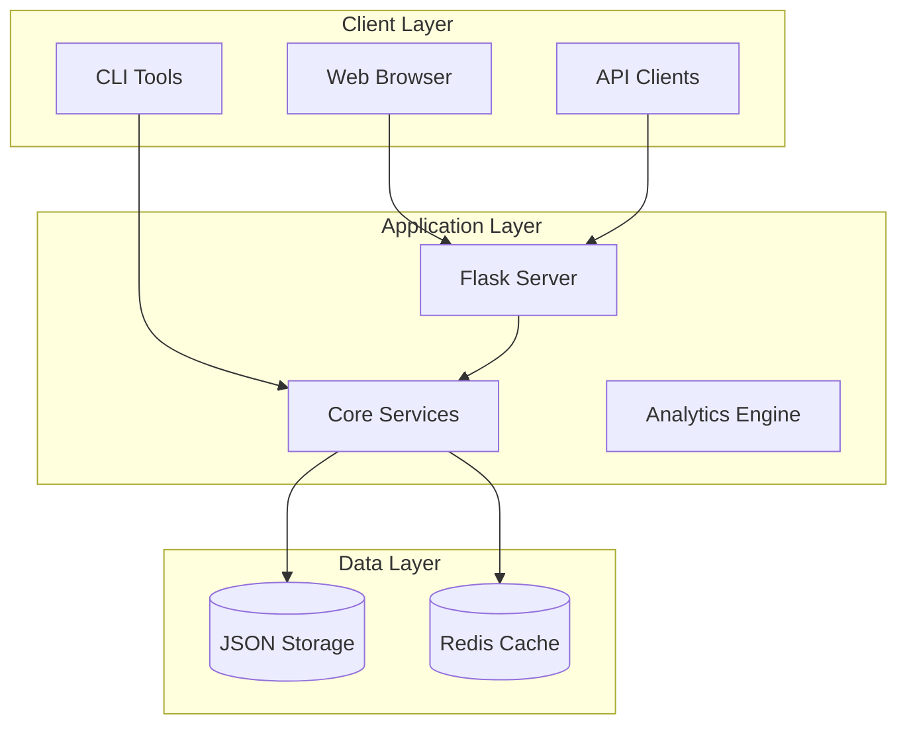

# Masterlist - Intelligent Project Management Platform

<div align="center">


**A comprehensive project management and analytics platform for tracking, analyzing, and optimizing software project ideas.**

[Features](#features) • [Installation](#installation) • [Usage](#usage) • [API](#api) • [Documentation](#documentation) • [Contributing](#contributing)

</div>

## 🚀 Features

### Core Capabilities
- **📊 Smart Project Categorization** - Automatic categorization across 12+ categories
- **🏷️ Intelligent Tagging** - AI-powered tag generation and management
- **🔍 Advanced Search** - Multi-criteria search with tag filtering
- **⭐ Quality Scoring** - Comprehensive quality assessment (0-10 scale)
- **📈 Real-time Analytics** - Live dashboards and performance metrics
- **🤖 AI Insights** - Market analysis and trend identification
- **👥 Collaboration** - Team workspaces, feedback, and project sharing
- **📱 Multi-platform** - Support for 15+ development platforms

### Technical Features
- **🌐 RESTful API** - Complete API for integration
- **🐳 Docker Support** - Containerized deployment
- **🔄 CI/CD Pipeline** - Automated testing and deployment
- **📊 Custom Reports** - Multiple export formats (JSON, CSV, PDF)
- **🔒 Security** - Built-in security best practices
- **⚡ Performance** - Optimized with caching and indexing

## 📋 Requirements

- Python 3.8 or higher
- 2GB RAM minimum
- 1GB disk space
- Docker (optional)
- Redis (optional, for caching)

## 🛠️ Installation

### Quick Start with Docker

```bash
# Clone the repository
git clone https://github.com/yourusername/masterlist.git
cd masterlist

# Start with Docker Compose
docker-compose up -d

# Access the application
open http://localhost:5000
```

### Manual Installation

```bash
# Clone the repository
git clone https://github.com/yourusername/masterlist.git
cd masterlist

# Create virtual environment
python -m venv venv
source venv/bin/activate  # On Windows: venv\Scripts\activate

# Install dependencies
pip install -r requirements.txt

# Run the application
python web/app.py
```

### Development Setup

```bash
# Install development dependencies
pip install -r requirements-dev.txt

# Run tests
pytest

# Run with live reload
FLASK_ENV=development python web/app.py
```

## 💡 Usage

### Web Interface

Access the web interface at `http://localhost:5000`

#### Main Features:
- **Dashboard** - Overview of all projects and key metrics
- **Projects** - Browse and filter project database
- **Search** - Advanced search with multiple criteria
- **Analytics** - Interactive charts and reports
- **QA** - Quality assurance reports
- **Insights** - AI-powered recommendations
- **Collaborate** - Team features and sharing

### Command Line Interface

```bash
# Search projects
./masterlist search "ai-powered" --min-quality 7

# Generate reports
./masterlist analytics executive --format pdf

# Tag projects
./masterlist tag-all

# Quality check
./masterlist qa validate
```

### Common Workflows

#### Finding High-Value Projects
```bash
# Search for high-revenue AI projects
./masterlist search-tags ai-powered high-revenue quick-win

# Export results
./masterlist export --format csv --filter "quality>=8"
```

#### Generating Analytics
```bash
# Generate all reports
make reports

# Specific analysis
./masterlist analytics trends --period 30
```

## 🔌 API

### Quick Start
```python
import requests

# Search for projects
response = requests.get("http://localhost:5000/api/search", 
    params={"q": "blockchain", "min_quality": 7})
projects = response.json()["results"]

# Get project details
project = requests.get("http://localhost:5000/api/project/ai-assistant").json()
```

### Key Endpoints
- `GET /api/projects` - List all projects
- `GET /api/search` - Search projects
- `GET /api/analytics/overview` - Get analytics
- `POST /api/reports/generate` - Generate reports

See [API Reference](docs/API_REFERENCE.md) for complete documentation.

## 📚 Documentation

### User Documentation
- [User Guide](docs/USER_GUIDE.md) - Complete user manual
- [API Reference](docs/API_REFERENCE.md) - API documentation
- [Examples](docs/examples/) - Code examples

### Developer Documentation
- [Architecture](docs/ARCHITECTURE.md) - System architecture
- [Developer Guide](docs/DEVELOPER_GUIDE.md) - Development guide
- [Contributing](CONTRIBUTING.md) - Contribution guidelines

### Quick Links
- [Installation Guide](#installation)
- [Configuration](docs/CONFIGURATION.md)
- [Troubleshooting](docs/TROUBLESHOOTING.md)
- [FAQ](docs/FAQ.md)

## 🏗️ Architecture



## 🧪 Testing

```bash
# Run all tests
pytest

# Run with coverage
pytest --cov=. --cov-report=html

# Run specific tests
pytest tests/test_search.py

# Run integration tests
pytest tests/integration/
```

## 🚀 Deployment

### Production Deployment

```bash
# Deploy to production
make deploy-production

# Health check
make health-check
```

### Environment Variables
```bash
FLASK_ENV=production
SECRET_KEY=your-secret-key
REDIS_URL=redis://localhost:6379
```

See [Deployment Guide](docs/DEPLOYMENT.md) for detailed instructions.

## 📊 Project Statistics

- **Total Projects**: 605+
- **Categories**: 12
- **Platforms**: 15+
- **Average Quality**: 7.2/10
- **High-Quality Projects**: 234+

## 🤝 Contributing

We welcome contributions! Please see our [Contributing Guide](CONTRIBUTING.md) for details.

### Development Process
1. Fork the repository
2. Create a feature branch
3. Make your changes
4. Run tests
5. Submit a pull request

### Code Style
- Follow PEP 8
- Use type hints
- Write docstrings
- Add tests for new features

## 📨 Roadmap

### Version 1.1 (Q2 2024)
- [ ] PostgreSQL support
- [ ] Advanced AI insights
- [ ] Mobile app
- [ ] Webhook support

### Version 2.0 (Q4 2024)
- [ ] Microservices architecture
- [ ] Kubernetes deployment
- [ ] GraphQL API
- [ ] Real-time collaboration

## 📄 License

This project is licensed under the MIT License - see the [LICENSE](LICENSE) file for details.

## 🙏 Acknowledgments

- Flask community for the excellent framework
- Contributors and testers
- Open source community

## 📞 Support

- **Documentation**: [docs/](docs/)
- **Issues**: [GitHub Issues](https://github.com/yourusername/masterlist/issues)
- **Discussions**: [GitHub Discussions](https://github.com/yourusername/masterlist/discussions)
- **Email**: support@masterlist.app

---

<div align="center">

**[Website](https://masterlist.app)** • **[Documentation](docs/)** • **[API](docs/API_REFERENCE.md)** • **[Contributing](CONTRIBUTING.md)**

Made with ❤️ by the Masterlist Team

</div>