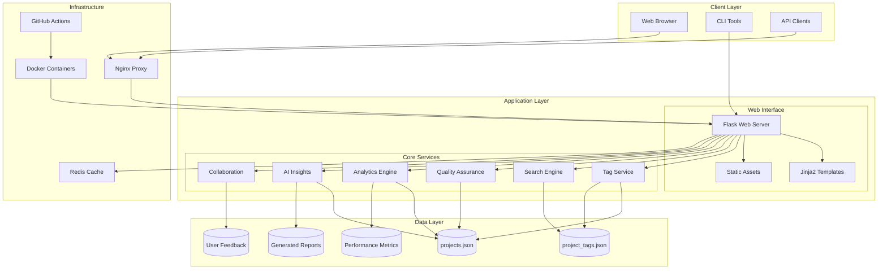
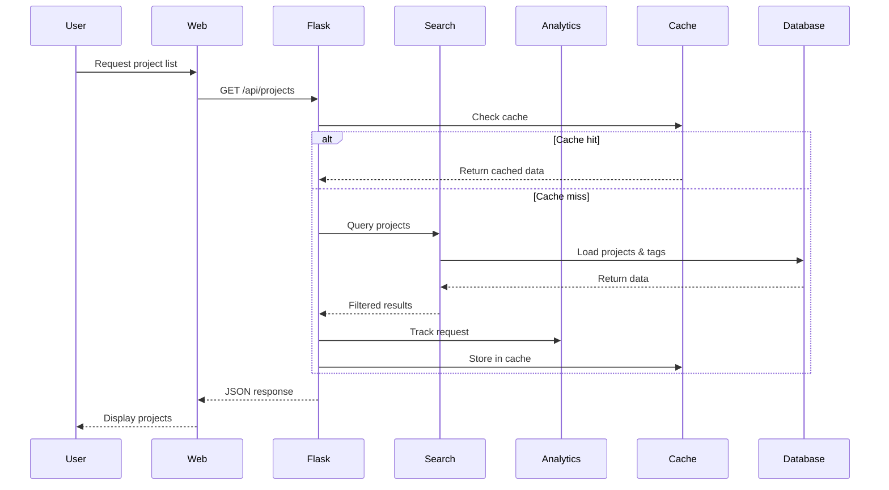
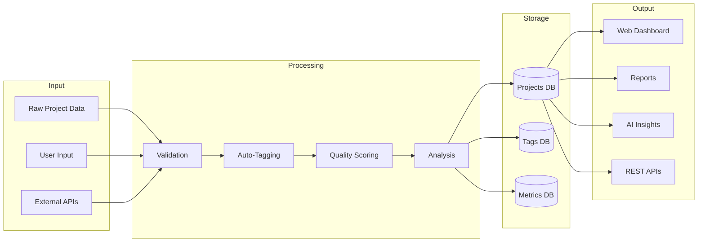
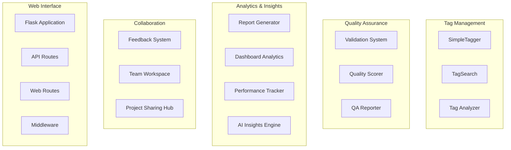
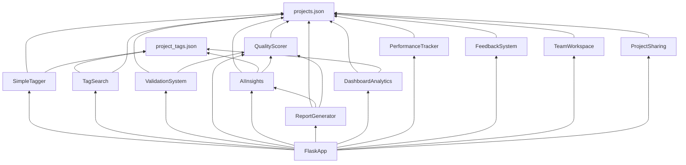
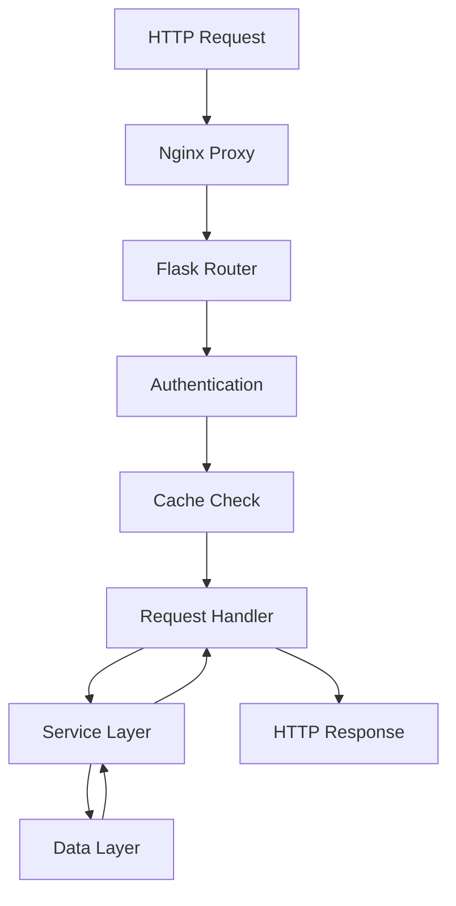
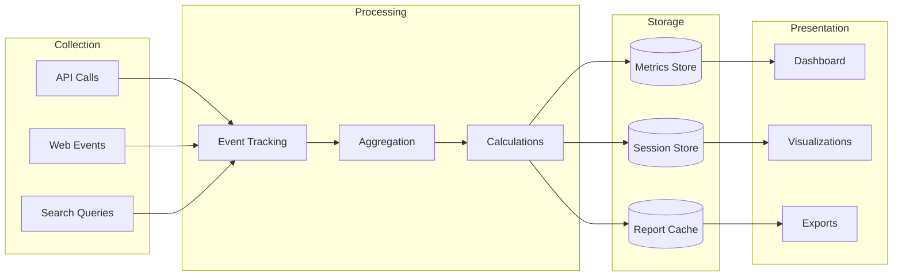
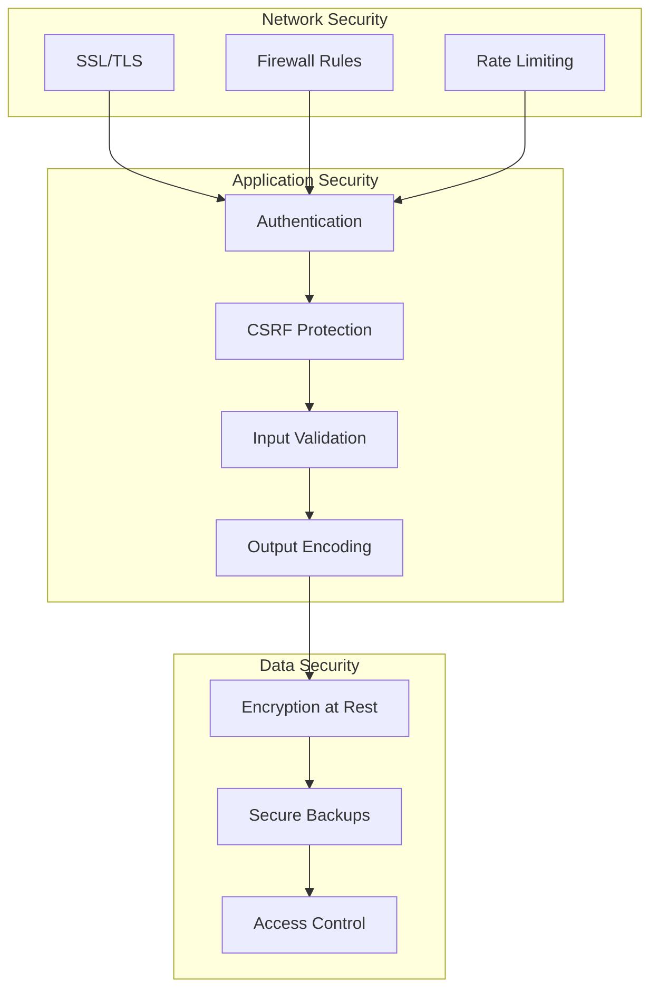
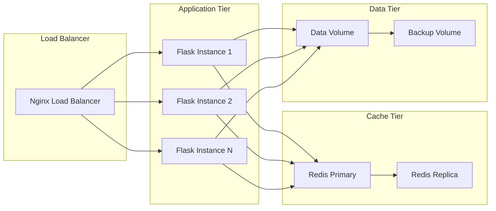

# Masterlist Architecture Documentation

## Table of Contents
1. [System Overview](#system-overview)
2. [Architecture Diagrams](#architecture-diagrams)
3. [Component Architecture](#component-architecture)
4. [Data Flow](#data-flow)
5. [Technology Stack](#technology-stack)
6. [Design Decisions](#design-decisions)
7. [Security Architecture](#security-architecture)
8. [Scalability](#scalability)

## System Overview

Masterlist is a comprehensive project management and analytics platform designed to track, analyze, and optimize software project ideas. The system provides intelligent categorization, quality scoring, collaboration features, and AI-powered insights.

### Key Features
- Smart project categorization and tagging
- Quality assessment and scoring
- Advanced search and filtering
- Collaborative project development
- AI-powered market insights
- Real-time analytics dashboard
- Automated CI/CD pipeline

## Architecture Diagrams

### High-Level System Architecture

### Component Interaction Diagram

### Data Flow Architecture

## Component Architecture

### Core Components

### Module Dependencies

## Data Flow

### Request Processing Pipeline

### Analytics Pipeline

## Technology Stack

### Backend
- **Language**: Python 3.8+
- **Framework**: Flask 2.x
- **Data Storage**: JSON files (projects.json, project_tags.json)
- **Caching**: Redis (optional)
- **Task Queue**: Celery (future)

### Frontend
- **Templates**: Jinja2
- **CSS Framework**: Bootstrap 5
- **JavaScript**: Vanilla JS, Chart.js
- **Icons**: Bootstrap Icons

### Infrastructure
- **Containerization**: Docker
- **Reverse Proxy**: Nginx
- **CI/CD**: GitHub Actions
- **Monitoring**: Custom performance tracking

### Development Tools
- **Testing**: pytest
- **Linting**: flake8, black
- **Type Checking**: mypy
- **Documentation**: Markdown, MkDocs

## Design Decisions

### 1. JSON File Storage
**Decision**: Use JSON files instead of traditional database
**Rationale**:
- Simplicity and portability
- Version control friendly
- No database dependencies
- Easy backup and migration
- Sufficient for current scale

### 2. Modular Architecture
**Decision**: Separate concerns into independent modules
**Rationale**:
- Easy to test and maintain
- Clear separation of concerns
- Enables parallel development
- Facilitates future microservices migration

### 3. Caching Strategy
**Decision**: Implement 5-minute cache for expensive operations
**Rationale**:
- Improves response times
- Reduces computational load
- Acceptable freshness for analytics
- Simple invalidation strategy

### 4. AI Integration Pattern
**Decision**: Separate AI insights generation from real-time operations
**Rationale**:
- Prevents blocking operations
- Allows for scheduled updates
- Reduces API costs
- Improves user experience

## Security Architecture

### Security Layers

### Security Measures
1. **Network Level**
   - HTTPS enforcement
   - Rate limiting on API endpoints
   - IP-based firewall rules

2. **Application Level**
   - Input validation and sanitization
   - CSRF token validation
   - Secure session management
   - Content Security Policy headers

3. **Data Level**
   - Encrypted backups
   - Access control lists
   - Audit logging

## Scalability

### Horizontal Scaling Strategy

### Performance Optimization
1. **Caching**
   - Redis for session storage
   - In-memory caching for analytics
   - Static asset caching

2. **Database Optimization**
   - JSON file compression
   - Indexed search operations
   - Lazy loading of large datasets

3. **Application Optimization**
   - Asynchronous task processing
   - Connection pooling
   - Request batching

### Future Scaling Considerations
1. **Database Migration**
   - PostgreSQL for relational data
   - Elasticsearch for search
   - MongoDB for document storage

2. **Microservices Architecture**
   - Separate analytics service
   - Independent AI service
   - Dedicated search service

3. **Cloud Native**
   - Kubernetes deployment
   - Auto-scaling policies
   - Cloud storage integration