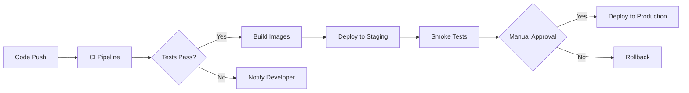

# CI/CD Guide

This guide covers the Continuous Integration and Continuous Deployment pipeline for Masterlist.

## Table of Contents
1. [Overview](#overview)
2. [GitHub Actions Workflows](#github-actions-workflows)
3. [Local Development](#local-development)
4. [Testing Strategy](#testing-strategy)
5. [Deployment Process](#deployment-process)
6. [Monitoring and Rollback](#monitoring-and-rollback)

## Overview

Our CI/CD pipeline is designed to ensure code quality, security, and reliable deployments:



## GitHub Actions Workflows

### 1. CI Pipeline (`ci.yml`)
Runs on every push and pull request:
- **Linting**: Black, isort, Flake8, MyPy
- **Testing**: Unit, integration, performance tests
- **Security**: Vulnerability scanning with Safety and Bandit
- **Quality**: Data validation and quality checks
- **Documentation**: Validates documentation completeness

### 2. Deploy Pipeline (`deploy.yml`)
Handles deployments to staging and production:
- **Staging**: Automatic deployment on develop branch
- **Production**: Manual approval required
- **Rollback**: Automatic rollback on failure

### 3. Scheduled Tasks (`scheduled-tasks.yml`)
Runs automated maintenance:
- **AI Insights**: Generate insights every 6 hours
- **Quality Checks**: Daily quality validation
- **Backups**: Automated data backups
- **Cleanup**: Remove old logs and reports

### 4. Release Pipeline (`release.yml`)
Manages version releases:
- **Version Validation**: Semantic versioning check
- **Package Building**: Python package and Docker images
- **Release Notes**: Automatic changelog generation
- **Multi-environment Deploy**: Staging → Production

### 5. Dependency Updates (`dependencies.yml`)
Weekly dependency management:
- **Security Scanning**: Check for vulnerabilities
- **License Validation**: Ensure license compatibility
- **Automated PRs**: Create update pull requests

## Local Development

### Pre-commit Hooks
Install pre-commit hooks for local quality checks:

```bash
# Install pre-commit
pip install pre-commit

# Install hooks
pre-commit install

# Run manually
pre-commit run --all-files
```

### Running CI Locally
Test the CI pipeline locally:

```bash
# Run pre-commit checks
./scripts/ci/pre-commit.sh

# Run full test suite
./scripts/ci/test-runner.sh

# Deploy to local Docker
docker build -t masterlist:local .
docker run -p 5000:5000 masterlist:local
```

## Testing Strategy

### Test Types
1. **Unit Tests** (`tests/unit/`)
   - Fast, isolated component tests
   - Mocked dependencies
   - 80% coverage requirement

2. **Integration Tests** (`tests/integration/`)
   - Test component interactions
   - Real dependencies
   - API endpoint testing

3. **Performance Tests** (`tests/performance/`)
   - Search performance benchmarks
   - Report generation timing
   - Memory usage profiling

4. **Security Tests**
   - Dependency vulnerability scanning
   - Static code analysis
   - Secret detection

### Running Tests
```bash
# Unit tests only
pytest tests/unit/ -v

# Integration tests
pytest tests/integration/ -v

# All tests with coverage
pytest --cov=. --cov-report=html

# Performance benchmarks
python tests/performance/test_search_performance.py
```

## Deployment Process

### Environments
- **Development**: Local development
- **Staging**: Pre-production testing
- **Production**: Live environment

### Deployment Steps
1. **Version Tag**: Create release tag
   ```bash
   git tag -a v1.0.0 -m "Release version 1.0.0"
   git push origin v1.0.0
   ```

2. **Automatic Process**:
   - Build and test
   - Create Docker images
   - Deploy to staging
   - Run smoke tests
   - Wait for approval
   - Deploy to production

### Manual Deployment
For emergency deployments:
```bash
# Deploy to staging
./scripts/ci/deploy.sh staging v1.0.0

# Deploy to production (requires approval)
./scripts/ci/deploy.sh production v1.0.0
```

## Monitoring and Rollback

### Health Checks
All environments have health endpoints:
- `/health` - Basic health check
- `/api/health` - Detailed health status

### Monitoring
- **Logs**: Centralized logging with timestamps
- **Metrics**: Performance and usage metrics
- **Alerts**: Automated alerts for failures

### Rollback Procedures
Automatic rollback on deployment failure:

```bash
# Manual rollback to previous version
./scripts/ci/rollback.sh production previous

# Rollback to specific version
./scripts/ci/rollback.sh production v0.9.5

# Restore from backup
./scripts/ci/rollback.sh production backup
```

### Emergency Procedures
1. **Immediate Rollback**:
   ```bash
   ssh deploy@production "docker stop masterlist-production"
   ./scripts/ci/rollback.sh production previous
   ```

2. **Data Recovery**:
   ```bash
   # List available backups
   ls -la /var/backups/masterlist/

   # Restore specific backup
   tar -xzf /var/backups/masterlist/backup_20240115_120000.tar.gz
   ```

3. **Incident Response**:
   - Check logs: `docker logs masterlist-production`
   - Review metrics: Check performance dashboards
   - Notify team: Automated Slack notifications

## Best Practices

### Code Quality
- Always run pre-commit hooks
- Maintain >80% test coverage
- Fix linting issues before commit
- Document breaking changes

### Security
- Never commit secrets
- Use environment variables
- Regular dependency updates
- Security scanning on every build

### Performance
- Monitor response times
- Profile memory usage
- Optimize database queries
- Cache expensive operations

### Deployment
- Test in staging first
- Use semantic versioning
- Document all changes
- Keep rollback plan ready

## Troubleshooting

### Common Issues

1. **Build Failures**
   - Check Docker daemon
   - Verify dependencies
   - Review error logs

2. **Test Failures**
   - Run tests locally
   - Check test data
   - Verify environment

3. **Deployment Issues**
   - Verify credentials
   - Check network access
   - Review deployment logs

4. **Performance Problems**
   - Check resource usage
   - Review slow queries
   - Analyze bottlenecks

### Getting Help
- Check workflow logs in GitHub Actions
- Review deployment logs
- Contact DevOps team
- Create incident ticket