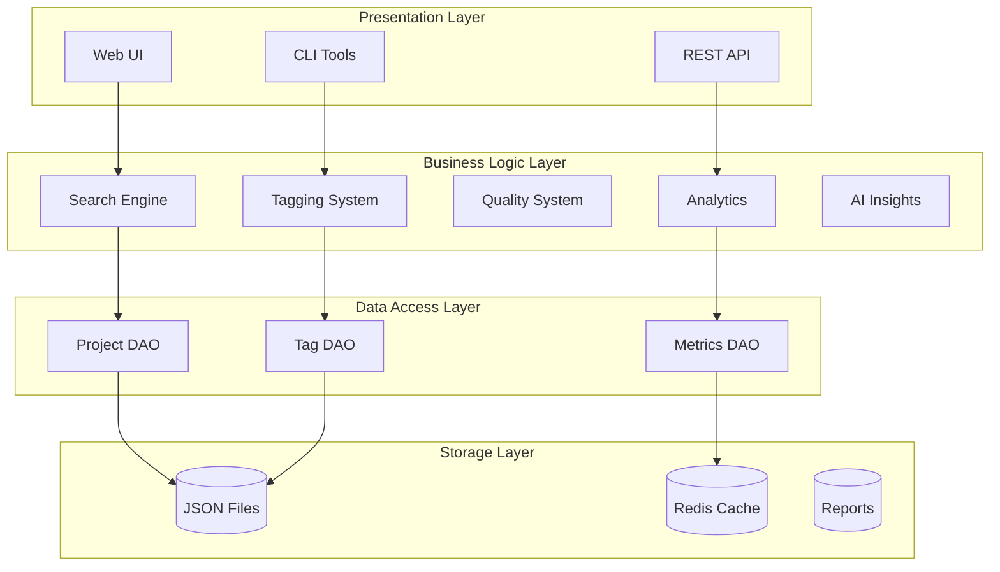
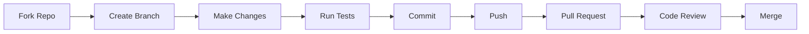

# Masterlist Developer Guide

## Table of Contents
1. [Development Setup](#development-setup)
2. [Project Structure](#project-structure)
3. [Architecture Overview](#architecture-overview)
4. [Core Modules](#core-modules)
5. [Adding New Features](#adding-new-features)
6. [Testing](#testing)
7. [API Development](#api-development)
8. [Database Schema](#database-schema)
9. [Contributing](#contributing)
10. [Deployment](#deployment)

## Development Setup

### Prerequisites
- Python 3.8 or higher
- Git
- Docker (optional)
- Redis (optional)

### Local Development Environment

```bash
# Clone the repository
git clone https://github.com/yourusername/masterlist.git
cd masterlist

# Create virtual environment
python -m venv venv
source venv/bin/activate  # On Windows: venv\Scripts\activate

# Install development dependencies
pip install -r requirements.txt
pip install -r requirements-dev.txt

# Set up pre-commit hooks
pre-commit install

# Run tests to verify setup
pytest

# Start development server
FLASK_ENV=development python web/app.py
```

### Development Tools Setup

```bash
# Install development tools
pip install black flake8 mypy pytest pytest-cov

# Configure VS Code (create .vscode/settings.json)
{
  "python.linting.enabled": true,
  "python.linting.flake8Enabled": true,
  "python.formatting.provider": "black",
  "python.formatting.blackArgs": ["--line-length", "120"],
  "editor.formatOnSave": true
}
```

## Project Structure

```
masterlist/
├── web/                    # Web interface
│   ├── app.py             # Flask application
│   ├── templates/         # Jinja2 templates
│   └── static/           # CSS, JS, images
├── analytics/             # Analytics and reporting
│   ├── report_generator.py
│   ├── dashboard_analytics.py
│   └── performance_tracker.py
├── collaboration/         # Collaboration features
│   ├── feedback_system.py
│   ├── team_workspace.py
│   └── project_sharing.py
├── insights/             # AI-powered insights
│   └── ai_insights.py
├── qa/                   # Quality assurance
│   ├── validation_system.py
│   └── quality_scorer.py
├── scripts/              # Utility scripts
│   ├── deploy.sh
│   ├── backup.sh
│   └── health_check.sh
├── tests/               # Test suite
│   ├── test_*.py
│   └── fixtures/
├── docs/                # Documentation
│   ├── ARCHITECTURE.md
│   ├── USER_GUIDE.md
│   └── API_REFERENCE.md
├── .github/             # GitHub Actions
│   └── workflows/
├── projects.json        # Project database
├── project_tags.json    # Tags database
├── requirements.txt     # Python dependencies
└── docker-compose.yml   # Docker configuration
```

## Architecture Overview

### Design Principles
1. **Modularity**: Each component is self-contained
2. **Simplicity**: JSON storage for easy management
3. **Extensibility**: Plugin-friendly architecture
4. **Performance**: Caching and optimization built-in
5. **Security**: Defense in depth approach

### Core Architecture



## Core Modules

### Tag System (simple_tagger.py)

```python
from simple_tagger import SimpleTagger

# Initialize tagger
tagger = SimpleTagger()

# Auto-tag a project
tags = tagger.auto_tag_project("ai-code-reviewer")

# Get tag suggestions
suggestions = tagger.suggest_tags(project_data)

# Bulk tagging
tagger.tag_all_projects()
```

#### Extending the Tagger
```python
class CustomTagger(SimpleTagger):
    def __init__(self):
        super().__init__()
        self.custom_rules = self.load_custom_rules()
    
    def apply_custom_rules(self, project):
        """Add custom tagging logic"""
        tags = []
        if "machine learning" in project.get("description", "").lower():
            tags.append("ml-enhanced")
        return tags
```

### Search Engine (tag_search.py)

```python
from tag_search import TagSearch

# Initialize search
searcher = TagSearch()

# Search by tags
results = searcher.search_by_tags(
    include_tags=["ai-powered", "high-revenue"],
    exclude_tags=["complex"],
    min_quality=7.0
)

# Advanced search
results = searcher.advanced_search({
    "text": "blockchain",
    "category": "fintech",
    "platforms": ["web", "mobile"],
    "date_range": ("2024-01-01", "2024-12-31")
})
```

### Quality Scoring (qa/quality_scorer.py)

```python
from qa.quality_scorer import QualityScorer

scorer = QualityScorer()

# Calculate score for a project
score = scorer.calculate_quality_score(project_data)

# Get detailed scoring breakdown
breakdown = scorer.get_score_breakdown(project_data)
# Returns: {
#     "completeness": 8.5,
#     "technical_feasibility": 7.0,
#     "market_potential": 9.0,
#     "overall": 8.2
# }
```

### Analytics Engine

```python
from analytics.dashboard_analytics import DashboardAnalytics

analytics = DashboardAnalytics()

# Get real-time metrics
metrics = analytics.get_live_metrics()

# Generate custom analytics
custom_data = analytics.generate_custom_analytics({
    "group_by": "category",
    "metrics": ["count", "avg_quality", "revenue_distribution"],
    "filters": {"min_quality": 6.0}
})
```

## Adding New Features

### Step-by-Step Guide

#### 1. Create Feature Module
```python
# features/my_feature.py
import json
from typing import Dict, List, Any

class MyFeature:
    def __init__(self, data_dir: str = "data"):
        self.data_dir = data_dir
        self.config = self.load_config()
    
    def process_data(self, input_data: Dict[str, Any]) -> Dict[str, Any]:
        """Main feature logic"""
        # Implementation
        pass
```

#### 2. Add Web Routes
```python
# web/app.py
from features.my_feature import MyFeature

my_feature = MyFeature()

@app.route('/api/my-feature', methods=['POST'])
def api_my_feature():
    data = request.get_json()
    result = my_feature.process_data(data)
    return jsonify(result)
```

#### 3. Create Templates
```html
<!-- web/templates/my_feature.html -->


<div class="container">
    <h1>My Feature</h1>
    <!-- Feature UI -->
</div>

```

#### 4. Add Tests
```python
# tests/test_my_feature.py
import pytest
from features.my_feature import MyFeature

def test_my_feature_basic():
    feature = MyFeature()
    result = feature.process_data({"test": "data"})
    assert result["status"] == "success"
```

### Feature Development Checklist
- [ ] Create feature module with clear interface
- [ ] Add comprehensive docstrings
- [ ] Implement error handling
- [ ] Add unit tests (aim for >80% coverage)
- [ ] Create integration tests
- [ ] Add API endpoints if needed
- [ ] Update documentation
- [ ] Add to CLI if applicable
- [ ] Update requirements.txt if new dependencies

## Testing

### Running Tests

```bash
# Run all tests
pytest

# Run with coverage
pytest --cov=. --cov-report=html

# Run specific test file
pytest tests/test_tag_system.py

# Run specific test
pytest tests/test_tag_system.py::test_auto_tagging

# Run with verbose output
pytest -v

# Run only fast tests
pytest -m "not slow"
```

### Writing Tests

#### Unit Test Example
```python
import pytest
from unittest.mock import Mock, patch

class TestQualityScorer:
    @pytest.fixture
    def scorer(self):
        return QualityScorer()
    
    @pytest.fixture
    def sample_project(self):
        return {
            "name": "Test Project",
            "description": "A complete description",
            "key_features": ["feature1", "feature2"],
            "technical_complexity": 5
        }
    
    def test_calculate_score(self, scorer, sample_project):
        score = scorer.calculate_quality_score(sample_project)
        assert 0 <= score <= 10
        assert isinstance(score, float)
    
    @patch('qa.quality_scorer.load_projects')
    def test_score_with_mock(self, mock_load, scorer):
        mock_load.return_value = {"test": {"name": "Test"}}
        scorer.score_all_projects()
        mock_load.assert_called_once()
```

#### Integration Test Example
```python
import pytest
from web.app import app

class TestAPIIntegration:
    @pytest.fixture
    def client(self):
        app.config['TESTING'] = True
        with app.test_client() as client:
            yield client
    
    def test_project_api(self, client):
        response = client.get('/api/projects')
        assert response.status_code == 200
        data = response.get_json()
        assert 'projects' in data
        assert 'total' in data
```

### Test Organization
```
tests/
├── unit/              # Unit tests
│   ├── test_tagger.py
│   ├── test_search.py
│   └── test_quality.py
├── integration/       # Integration tests
│   ├── test_api.py
│   └── test_workflow.py
├── fixtures/         # Test data
│   ├── projects.json
│   └── tags.json
└── conftest.py      # Shared fixtures
```

## API Development

### RESTful API Design

#### Endpoint Structure
```
GET    /api/projects          # List projects
GET    /api/projects/:id      # Get specific project
POST   /api/projects          # Create project
PUT    /api/projects/:id      # Update project
DELETE /api/projects/:id      # Delete project

GET    /api/search            # Search projects
POST   /api/analytics/report  # Generate report
GET    /api/insights          # Get AI insights
```

### Adding New Endpoints

```python
from flask import Blueprint
from functools import wraps
import time

# Create blueprint
api_v2 = Blueprint('api_v2', __name__, url_prefix='/api/v2')

# Rate limiting decorator
def rate_limit(max_calls=10, window=60):
    def decorator(f):
        calls = {}
        
        @wraps(f)
        def wrapped(*args, **kwargs):
            now = time.time()
            ip = request.remote_addr
            
            if ip not in calls:
                calls[ip] = []
            
            # Remove old calls
            calls[ip] = [c for c in calls[ip] if now - c < window]
            
            if len(calls[ip]) >= max_calls:
                return jsonify({"error": "Rate limit exceeded"}), 429
            
            calls[ip].append(now)
            return f(*args, **kwargs)
        
        return wrapped
    return decorator

# Endpoint with rate limiting
@api_v2.route('/expensive-operation', methods=['POST'])
@rate_limit(max_calls=5, window=300)  # 5 calls per 5 minutes
def expensive_operation():
    data = request.get_json()
    # Process data
    return jsonify({"status": "success"})

# Register blueprint
app.register_blueprint(api_v2)
```

### API Documentation

#### OpenAPI/Swagger Integration
```python
from flask_swagger_ui import get_swaggerui_blueprint

SWAGGER_URL = '/api/docs'
API_URL = '/static/swagger.json'

swaggerui_blueprint = get_swaggerui_blueprint(
    SWAGGER_URL,
    API_URL,
    config={'app_name': "Masterlist API"}
)

app.register_blueprint(swaggerui_blueprint, url_prefix=SWAGGER_URL)
```

## Database Schema

### Project Schema
```json
{
  "project_key": {
    "name": "string",
    "description": "string",
    "problem_statement": "string",
    "solution_description": "string",
    "target_users": "string",
    "category": "string",
    "platforms": ["string"],
    "key_features": ["string"],
    "technical_complexity": "number",
    "development_time": "string",
    "team_size": "string",
    "budget_estimate": "string",
    "revenue_model": "string",
    "revenue_potential": "string",
    "competition_level": "string",
    "market_size": "string",
    "monetization_strategy": "string",
    "success_metrics": ["string"],
    "risks": ["string"],
    "quality_score": "number",
    "created_at": "datetime",
    "updated_at": "datetime"
  }
}
```

### Tag Schema
```json
{
  "project_key": [
    "tag1",
    "tag2",
    "tag3"
  ]
}
```

### Migration Support
```python
# migrations/migrate_v1_to_v2.py
import json
from datetime import datetime

def migrate_projects():
    """Migrate projects from v1 to v2 schema"""
    with open('projects.json', 'r') as f:
        data = json.load(f)
    
    # Add new fields
    for key, project in data['projects'].items():
        if 'created_at' not in project:
            project['created_at'] = datetime.now().isoformat()
        if 'version' not in project:
            project['version'] = 2
    
    # Backup old version
    with open('projects.v1.backup.json', 'w') as f:
        json.dump(data, f)
    
    # Save migrated version
    with open('projects.json', 'w') as f:
        json.dump(data, f, indent=2)
```

## Contributing

### Development Workflow



### Code Style Guide

#### Python Style
```python
# Good
def calculate_project_score(
    project: Dict[str, Any],
    weights: Optional[Dict[str, float]] = None
) -> float:
    """
    Calculate quality score for a project.
    
    Args:
        project: Project data dictionary
        weights: Optional scoring weights
        
    Returns:
        Quality score between 0 and 10
    """
    if weights is None:
        weights = DEFAULT_WEIGHTS
    
    score = 0.0
    for criterion, weight in weights.items():
        score += evaluate_criterion(project, criterion) * weight
    
    return min(10.0, max(0.0, score))

# Bad
def calc_score(p, w=None):
    s = 0
    for c in w or DEFAULT_WEIGHTS:
        s += eval_crit(p, c) * w[c]
    return s
```

### Pull Request Guidelines

#### PR Template
```markdown
## Description
Brief description of changes

## Type of Change
- [ ] Bug fix
- [ ] New feature
- [ ] Breaking change
- [ ] Documentation update

## Testing
- [ ] Unit tests pass
- [ ] Integration tests pass
- [ ] Manual testing completed

## Checklist
- [ ] Code follows style guidelines
- [ ] Self-review completed
- [ ] Documentation updated
- [ ] No new warnings
```

## Deployment

### Production Deployment

#### Pre-deployment Checklist
```bash
# 1. Run full test suite
make full-test

# 2. Check code quality
make lint

# 3. Verify configuration
python scripts/verify_config.py

# 4. Create backup
make backup

# 5. Build Docker image
make build
```

#### Deployment Process
```bash
# Deploy to staging
make deploy-staging

# Run smoke tests
make health-check

# Deploy to production
make deploy-production

# Verify deployment
curl https://masterlist.app/api/health
```

### Monitoring

#### Application Metrics
```python
# Add custom metrics
from analytics.performance_tracker import PerformanceTracker

tracker = PerformanceTracker()

# Track custom metric
tracker.track_custom_metric("feature_usage", {
    "feature": "ai_insights",
    "user_id": "user123",
    "duration": 2.5
})
```

#### Health Checks
```python
@app.route('/health/ready')
def health_ready():
    """Readiness probe for Kubernetes"""
    checks = {
        "database": check_database(),
        "cache": check_cache(),
        "disk_space": check_disk_space()
    }
    
    if all(checks.values()):
        return jsonify({"status": "ready", "checks": checks}), 200
    else:
        return jsonify({"status": "not ready", "checks": checks}), 503
```

### Troubleshooting

#### Common Issues

1. **Import Errors**
```bash
# Fix Python path
export PYTHONPATH="${PYTHONPATH}:$(pwd)"
```

2. **Permission Errors**
```bash
# Fix file permissions
chmod -R 755 scripts/
chmod 644 *.json
```

3. **Memory Issues**
```python
# Use generators for large datasets
def process_projects():
    with open('projects.json') as f:
        data = json.load(f)
    
    for key, project in data['projects'].items():
        yield process_single_project(project)
```

#### Debug Mode
```bash
# Enable debug logging
export FLASK_DEBUG=1
export LOG_LEVEL=DEBUG

# Run with debugger
python -m pdb web/app.py
```

### Performance Optimization

#### Profiling
```python
import cProfile
import pstats

def profile_function():
    profiler = cProfile.Profile()
    profiler.enable()
    
    # Code to profile
    expensive_operation()
    
    profiler.disable()
    stats = pstats.Stats(profiler)
    stats.sort_stats('cumulative')
    stats.print_stats(20)
```

#### Caching Strategy
```python
from functools import lru_cache
import hashlib

@lru_cache(maxsize=1000)
def get_project_by_key(key: str) -> Dict[str, Any]:
    """Cached project retrieval"""
    return load_project(key)

# Cache with TTL
class TTLCache:
    def __init__(self, ttl=300):
        self.cache = {}
        self.ttl = ttl
    
    def get(self, key):
        if key in self.cache:
            value, timestamp = self.cache[key]
            if time.time() - timestamp < self.ttl:
                return value
        return None
    
    def set(self, key, value):
        self.cache[key] = (value, time.time())
```