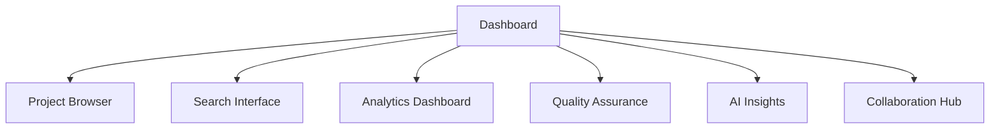
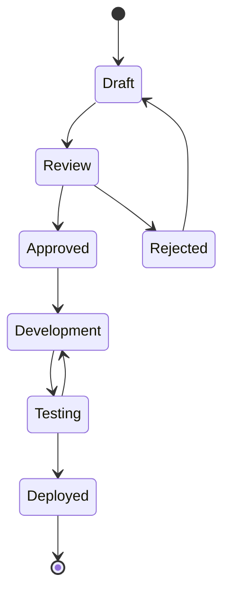

# Masterlist User Guide

## Table of Contents
1. [Getting Started](#getting-started)
2. [Web Interface](#web-interface)
3. [Command Line Interface](#command-line-interface)
4. [Project Management](#project-management)
5. [Search and Filtering](#search-and-filtering)
6. [Analytics and Reports](#analytics-and-reports)
7. [Collaboration Features](#collaboration-features)
8. [API Usage](#api-usage)
9. [Tips and Best Practices](#tips-and-best-practices)

## Getting Started

### Installation

#### Using Docker (Recommended)
```bash
# Clone the repository
git clone https://github.com/yourusername/masterlist.git
cd masterlist

# Start with Docker Compose
docker-compose up -d

# Access the web interface
open http://localhost:5000
```

#### Manual Installation
```bash
# Clone the repository
git clone https://github.com/yourusername/masterlist.git
cd masterlist

# Create virtual environment
python -m venv venv
source venv/bin/activate  # On Windows: venv\Scripts\activate

# Install dependencies
pip install -r requirements.txt

# Start the web server
python web/app.py
```

### Quick Start Checklist
- [ ] Install the application
- [ ] Access web interface at http://localhost:5000
- [ ] Explore the project dashboard
- [ ] Try searching for projects
- [ ] Generate your first report

## Web Interface

### Dashboard Overview



### Navigation

#### Main Menu
- **Home**: Overview and statistics
- **Projects**: Browse all projects
- **Search**: Advanced search interface
- **Analytics**: Data visualization and metrics
- **QA**: Quality reports and validation
- **Insights**: AI-powered recommendations
- **Collaborate**: Team features and sharing

### Project Browser

#### Viewing Projects
1. Navigate to **Projects** from the main menu
2. Use filters on the left sidebar:
   - Category (AI/ML, Productivity, etc.)
   - Platform (Web, Mobile, Desktop)
   - Quality Score (0-10)
   - Revenue Potential
   - Development Timeline

#### Project Details
Click on any project to view:
- Full description and problem statement
- Technical specifications
- Quality score breakdown
- Similar projects
- User feedback and ratings

### Search Interface

#### Basic Search
1. Click on **Search** in the navigation
2. Enter keywords in the search box
3. Press Enter or click Search

#### Advanced Search
Use the advanced filters:
- **Include Tags**: Projects must have these tags
- **Exclude Tags**: Projects must not have these tags
- **Quality Range**: Minimum and maximum quality scores
- **Complexity**: Technical complexity level

#### Search Syntax
```
Examples:
- "ai-powered AND high-revenue"
- "blockchain NOT complex"
- "quick-win OR short-term"
```

### Analytics Dashboard

#### Available Metrics
1. **Overview Metrics**
   - Total projects
   - Average quality score
   - Category distribution
   - Platform diversity

2. **Quality Analytics**
   - Score distribution chart
   - Quality by category
   - Improvement trends

3. **Revenue Analytics**
   - High-revenue opportunities
   - Revenue by category
   - ROI projections

4. **Timeline Analytics**
   - Quick wins identification
   - Development time distribution
   - Resource planning

#### Generating Charts
1. Navigate to **Analytics**
2. Select metric type from dropdown
3. Choose visualization format
4. Click "Generate Chart"
5. Export as image or data

## Command Line Interface

### Basic Commands

#### Project Management
```bash
# List all projects
./masterlist list

# Search projects
./masterlist search "ai-powered"

# View project details
./masterlist show project-key

# Add new project
./masterlist add --interactive
```

#### Tagging
```bash
# Auto-tag all projects
./masterlist tag-all

# Tag specific project
./masterlist tag project-key

# Search by tags
./masterlist search-tags ai-powered high-revenue
```

#### Quality Assurance
```bash
# Run quality validation
./masterlist qa validate

# Generate quality report
./masterlist qa report

# Fix quality issues
./masterlist qa fix
```

#### Analytics
```bash
# Generate executive summary
./masterlist analytics executive

# Create quality report
./masterlist analytics quality --format html

# Generate trend analysis
./masterlist analytics trends --period 30

# Custom report
./masterlist analytics custom --category ai-ml --min-quality 7
```

### Advanced CLI Usage

#### Batch Operations
```bash
# Export projects to CSV
./masterlist export --format csv --output projects.csv

# Import projects from file
./masterlist import --file new_projects.json

# Bulk update quality scores
./masterlist update-quality --recalculate
```

#### Pipeline Integration
```bash
# Use in scripts
PROJECTS=$(./masterlist list --format json | jq '.projects[]')

# Filter high-quality projects
./masterlist search --min-quality 8 --format json | \
  jq '.results[] | select(.revenue_potential == "High")'
```

## Project Management

### Adding New Projects

#### Via Web Interface
1. Click "Add Project" button
2. Fill in the form:
   - Project name and description
   - Problem statement
   - Target users
   - Key features
   - Technical specifications
3. Submit for auto-tagging and scoring

#### Via CLI
```bash
./masterlist add \
  --name "My Project" \
  --category "ai-ml" \
  --platform "web" \
  --description "Project description"
```

### Editing Projects

#### Web Interface
1. Navigate to project details
2. Click "Edit" button
3. Modify fields
4. Save changes

#### CLI
```bash
./masterlist edit project-key --field quality_score --value 8.5
```

### Project Workflow



## Search and Filtering

### Search Strategies

#### Finding High-Value Projects
```bash
# High revenue + quick implementation
./masterlist search-tags high-revenue quick-win

# Quality AI projects
./masterlist search "ai-powered" --min-quality 8
```

#### Technology-Specific Searches
```bash
# Blockchain projects
./masterlist search --tags blockchain --platform web

# No-code solutions
./masterlist search-tags no-code beginner-friendly
```

### Saved Searches
1. Perform a search
2. Click "Save Search"
3. Name your search
4. Access from "My Searches" menu

### Search Tips
- Use quotes for exact phrases
- Combine filters for precision
- Save frequently used searches
- Export results for analysis

## Analytics and Reports

### Report Types

#### Executive Summary
- High-level metrics
- Category distribution
- Top opportunities
- Risk assessment

#### Quality Report
- Score distribution
- Quality by category/platform
- Improvement recommendations
- Low-quality project list

#### Trend Analysis
- Emerging technologies
- Growing categories
- Platform adoption
- User engagement trends

### Generating Reports

#### Web Interface
1. Navigate to Analytics
2. Select "Generate Report"
3. Choose report type
4. Select format (PDF, HTML, JSON)
5. Click "Generate"

#### CLI
```bash
# Generate all reports
make reports

# Specific report
./masterlist analytics executive --format pdf
```

### Scheduling Reports
```bash
# Add to crontab for daily reports
0 9 * * * cd /path/to/masterlist && make reports
```

## Collaboration Features

### Team Workspaces

#### Creating a Team
1. Go to Collaborate → Teams
2. Click "Create Team"
3. Add team members
4. Set permissions

#### Team Features
- Shared project lists
- Task assignment
- Progress tracking
- Team analytics

### Project Sharing

#### Sharing Projects
1. Open project details
2. Click "Share"
3. Choose visibility:
   - Public: Anyone can view
   - Team: Team members only
   - Private: Only you

#### Collaboration Tools
- Comments and discussions
- Rating and feedback
- Version history
- Fork projects

### Feedback System

#### Providing Feedback
1. Navigate to project
2. Click "Add Feedback"
3. Select type:
   - Bug report
   - Feature request
   - Improvement suggestion
   - General comment

#### Managing Feedback
- Vote on feedback items
- Filter by type/status
- Export feedback reports
- Track resolution

## API Usage

### Authentication
```bash
# Get API token
curl -X POST http://localhost:5000/api/auth/token \
  -H "Content-Type: application/json" \
  -d '{"username": "user", "password": "pass"}'
```

### Common Endpoints

#### Projects
```bash
# List projects
curl http://localhost:5000/api/projects

# Get specific project
curl http://localhost:5000/api/project/ai-code-reviewer

# Search projects
curl "http://localhost:5000/api/search?q=blockchain&min_quality=7"
```

#### Analytics
```bash
# Get overview metrics
curl http://localhost:5000/api/analytics/overview

# Quality analytics
curl http://localhost:5000/api/analytics/quality

# Generate report
curl -X POST http://localhost:5000/api/reports/generate \
  -H "Content-Type: application/json" \
  -d '{"type": "executive", "format": "json"}'
```

### API Examples

#### Python
```python
import requests

# Get high-quality projects
response = requests.get(
    "http://localhost:5000/api/projects",
    params={"min_quality": 8, "per_page": 20}
)
projects = response.json()['projects']
```

#### JavaScript
```javascript
// Search projects
fetch('http://localhost:5000/api/search?q=ai-powered')
  .then(response => response.json())
  .then(data => {
    console.log(`Found ${data.total} projects`);
    data.results.forEach(project => {
      console.log(`- ${project.name} (${project.quality_score}/10)`);
    });
  });
```

## Tips and Best Practices

### Maximizing Value

1. **Regular Reviews**
   - Check AI insights weekly
   - Review quality scores monthly
   - Update project status

2. **Smart Searching**
   - Combine multiple filters
   - Use tag combinations
   - Save useful searches

3. **Quality Focus**
   - Prioritize high-quality projects
   - Use QA reports for improvements
   - Track quality trends

### Productivity Tips

#### Keyboard Shortcuts
- `/` - Focus search
- `p` - Go to projects
- `a` - Go to analytics
- `?` - Show help

#### Quick Actions
- Star projects for quick access
- Use bulk operations for efficiency
- Set up email notifications
- Create project templates

### Troubleshooting

#### Common Issues

1. **Slow Performance**
   ```bash
   # Clear cache
   make clean
   
   # Optimize database
   make db-optimize
   ```

2. **Search Not Working**
   ```bash
   # Rebuild search index
   ./masterlist reindex
   ```

3. **Reports Not Generating**
   ```bash
   # Check logs
   tail -f logs/app.log
   
   # Run diagnostics
   make health-check
   ```

### Getting Help

1. **Documentation**
   - Architecture guide
   - API reference
   - Developer guide

2. **Support Channels**
   - GitHub Issues
   - Community Forum
   - Email Support

3. **Resources**
   - Video tutorials
   - Example projects
   - Best practices guide